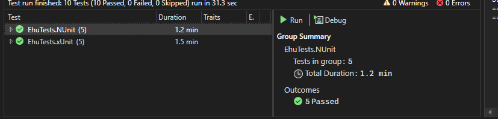
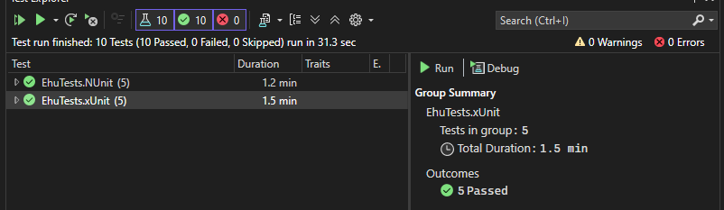

# Test Results Summary

## Скриншоты результатов

| NUnit Results | xUnit Results |
|---------------|----------------|
|  |  |

## Overview

Two test projects were executed to compare the behavior of **NUnit** and **xUnit** test runners in the context of UI/browser testing.

| Project | Total Tests | Result | Duration |
|---------|-------------|--------|----------|
| EhuTests.NUnit | 5 | ✅ All Passed | 1.2 min |
| EhuTests.xUnit | 5 | ✅ All Passed | 1.5 min |

---

## Test Execution Details

### EhuTests.NUnit
- **Tests in group:** 5
- **Total duration:** 1.2 min
- **Outcome:** 5 passed

### EhuTests.xUnit
- **Tests in group:** 5
- **Total duration:** 1.5 min
- **Outcome:** 5 passed

---

## Key Features Implemented

| Feature | NUnit | xUnit |
|---------|-------|-------|
| Parallel test execution (within project) | ✅ | ✅ |
| Setup / Teardown | `[SetUp]` / `[TearDown]` | Constructor / `Dispose` |
| Data Providers | `[TestCase]` | `[InlineData]` |
| Test filtering (Categories / Traits) | `[Category]` | `[Trait]` |

---

## Conclusion

Both test runners work correctly — all tests passed successfully.

- **Parallelism** is implemented within each project as required.
- **NUnit** proved to be more intuitive and readable for UI testing scenarios.
- **xUnit** is more modern and flexible, but slightly more complex to configure for browser-based tests.

### Recommendation
For UI/browser automation, **NUnit** offers better readability and simpler setup.  
For general-purpose or modern .NET projects, **xUnit** remains a strong choice despite its slight learning curve.
